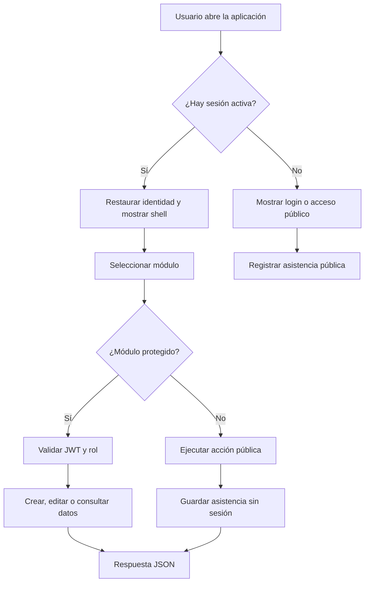
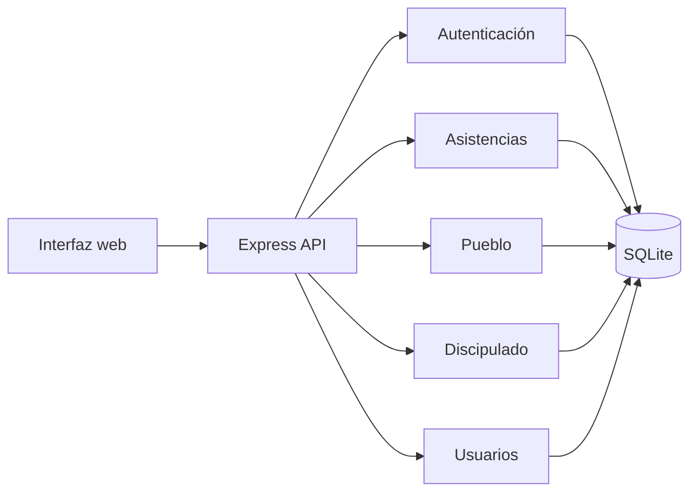
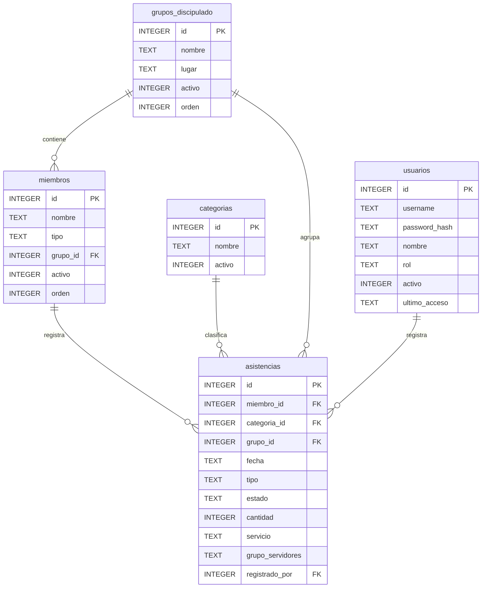

# Flujo, ER y casos de uso del sistema

## Propósito

Este documento reúne la vista funcional y estructural del sistema para facilitar revisiones
manuales, refactorización guiada y consultas rápidas durante cambios futuros.

## Flujo general de la aplicación

## Flujo de negocio actual

## Diagrama ER de la base de datos

## Casos de uso actuales

### Acceso público

- Registrar asistencia de Pueblo sin iniciar sesión.
- Consultar formulario público de asistencia de Pueblo.
- Visualizar confirmación o error del registro público.

### Acceso autenticado

- Iniciar sesión.
- Restaurar sesión activa.
- Registrar asistencia de Discipulado.
- Registrar asistencia de Pueblo con permisos autenticados.
- Consultar resumen del tablero.
- Consultar historial de asistencias.

### Acceso administrativo

- Gestionar usuarios.
- Activar o desactivar usuarios.
- Cambiar contraseñas.
- Gestionar categorías de Pueblo.
- Gestionar grupos y miembros de Discipulado.

## Casos de uso que se quieren habilitar sin sesión

El objetivo de la siguiente mejora es permitir únicamente registro de asistencia sin
autenticación, pero sin exponer mantenimiento de catálogos ni administración.

### Casos permitidos sin sesión

- Registrar asistencia de Pueblo.
- Registrar asistencia de Discipulado.

### Casos bloqueados sin sesión

- Crear, editar o eliminar categorías.
- Crear, editar o eliminar grupos.
- Crear, editar o eliminar miembros.
- Crear, editar o eliminar usuarios.
- Consultar reportes administrativos.

## Plan manual sugerido para implementar el acceso público

### Paso 1: Separar lectura de escritura

Crear rutas públicas solo para `POST` de asistencia y mantener las rutas de catálogo
protegidas por JWT.

### Paso 2: Exponer un contrato público mínimo

Permitir que los formularios públicos consuman solo los datos necesarios para registrar:

- categorías activas
- grupos activos
- miembros activos por grupo, si aplica

### Paso 3: Validar con permisos por ruta

Revisar que:

- `POST` de asistencia público no requiera sesión
- `GET`, `PUT` y `DELETE` sigan protegidos
- las rutas de categorías, grupos y usuarios continúen autenticadas

### Paso 4: Ajustar frontend

Agregar pantallas o formularios públicos para registrar asistencia sin iniciar sesión.
El formulario solo debe enviar datos de creación, no cambios en catálogos.

### Paso 5: Verificar contratos

Actualizar documentación, colección Postman y pruebas automáticas para cubrir el flujo
público y los bloqueos administrativos.

## Observación de arquitectura

La base actual ya separa bien el dominio de asistencia del dominio administrativo. El cambio
necesario no es reorganizar la base de datos, sino abrir selectivamente las operaciones de
registro y mantener cerrada la administración de catálogos.
